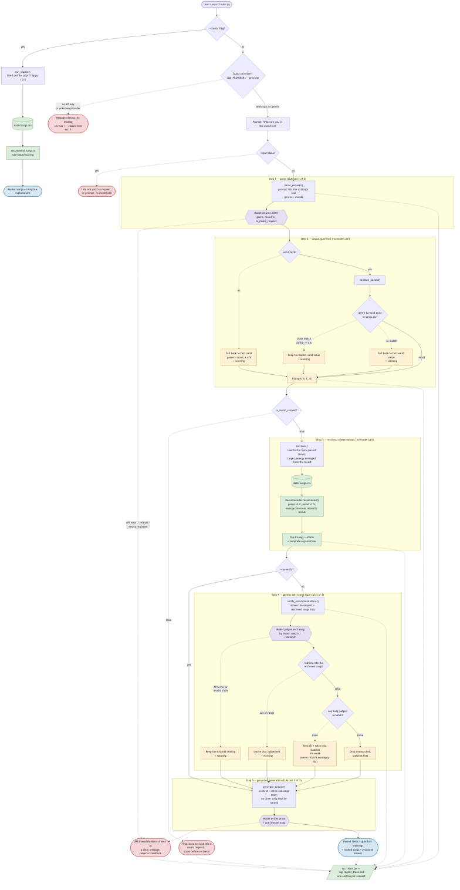

# 🎵 Music Recommender Simulation — VibeMatch 2.0

A rule-based music recommender extended with a natural-language front end, a
retrieval-augmented generation (RAG) pipeline, an agentic self-check, and
guardrails.

---

## 1. The Base Project

**Base project:** *Music Recommender Simulation* (**VibeMatch 1.0**) — the
classroom starter project in this repository, before this extension. Its code is
`src/recommender.py`, `src/main.py`, `data/songs.csv`, and
`tests/test_recommender.py`, and it is preserved in git history at the commit
tagged *"Baseline: rule-based Music Recommender Simulation before AI extension"*.

**Its original goal:** show how a catalog plus a scoring rule becomes a ranked
list of recommendations, with a plain-language reason attached to every pick.

**What it could already do:**

- Load a 10-song catalog from `data/songs.csv` (id, title, artist, genre, mood,
  energy, tempo, valence, danceability, acousticness).
- Score every song against a hardcoded taste profile: **genre match +2.0**,
  **mood match +1.5**, **energy closeness up to +1.0** (scaled by
  `1 - |song.energy - target|`), plus an **acousticness bonus** in the
  object-oriented version.
- Sort by score and return the top *k*, each with a template explanation
  ("matches your pop taste, fits your happy mood").
- Run as a CLI (`python -m src.main`) and expose a `Recommender` class covered by
  two unit tests.

**What it could not do — the gap this extension closes:** the profile was
**hardcoded in the source** (`{"genre": "pop", "mood": "happy", "energy": 0.8}`).
A user could not describe what they wanted. Changing the request meant editing
Python. The scoring logic itself was sound; the *interface* to it was the
limitation.

---

## 2. What This Extension Adds

The original scoring rule is untouched and still decides what gets returned. The
new code sits on either side of it: a language model turns free text into a
structured query going in, and writes a grounded answer coming out.

### Natural-language recommendations (RAG)

`src/nl_recommender.py`. Ask in plain English — *"I want something chill for
studying"* — and the pipeline runs five steps:

1. **Parse** (model call 1) — the request becomes structured JSON
   `{genre, mood, k}`. The prompt is built from the catalog's *real* vocabulary,
   read out of `songs.csv` at startup, so the model is only ever offered values
   that exist.
2. **Guardrail** (no model call) — the JSON is validated before it is trusted.
3. **Retrieve** (no model call) — the validated fields become a `UserProfile`,
   and **the original `Recommender` class ranks the real catalog.**
4. **Verify** (model call 2) — the agentic self-check, below.
5. **Generate** (model call 3) — a natural-language answer grounded *only* in the
   retrieved rows.

**Why retrieval is deliberately not done by the model:** the model chooses *what
to look for*; deterministic code decides *what comes back*. A model asked to
"recommend songs" invents plausible ones. A model handed nine real rows and told
to describe them cannot. That split is the whole point of the R in RAG — and it
means the grading-relevant behaviour (which songs, in what order, with what
score) stays reproducible.

The original mode still works unchanged via `--classic`, which needs no API key.

### Agentic self-check

`src/agent_check.py`. After retrieval, a second model pass is shown the parsed
request and the songs that were actually retrieved, and judges each one. Songs it
calls a mismatch are dropped; survivors are re-ranked with confirmed matches
first.

Two constraints keep this from being just another chance to hallucinate:

- **It selects by index, not by name.** The verifier can only refer to
  `1..len(retrieved)`; code maps those integers back to the real objects. It
  cannot add a song, rename one, or reference anything outside the list. An
  out-of-range index is discarded with a warning.
- **It can never empty the list.** If it rejects everything, the original ranking
  is kept and the user is told the matches are weak. A recommender returning
  nothing is worse than one returning an honest *"these are loose fits"*.

So the model's judgement is advisory input to a deterministic filter, never a
direct writer of output.

### Reasoning trace

`src/trace.py` appends one Markdown section per request to
**[`logs/agent_trace.md`](logs/agent_trace.md)**: what the parse step extracted
and why, which guardrails fired, what retrieval returned with scores, what the
verifier judged song-by-song, and the final answer. Referenced from
[`ai_interactions.md`](ai_interactions.md). Disable with `--no-trace`.

### Guardrails

See [section 6](#6-guardrails-in-action) for worked examples. Nothing in the
pipeline raises an unhandled exception at the user.

### Swappable model backend

`src/llm.py` puts the one thing this project needs from a model — system prompt +
user message → text — behind a single method, with two implementations:

| Provider | Default model | Env var |
|---|---|---|
| `anthropic` (default) | `claude-sonnet-4-6` | `ANTHROPIC_API_KEY` |
| `gemini` | `gemini-2.5-flash` | `GEMINI_API_KEY` |

Everything above that seam is provider-agnostic, so the recommender, guardrails,
self-check, and harness are written once. Tests inject a `FakeProvider` and never
touch the network.

### New and changed files

| File | Status | Purpose |
|---|---|---|
| `src/recommender.py` | **unchanged** | Original scoring and `Recommender` class |
| `data/songs.csv` | **unchanged** | The 10-song catalog |
| `src/main.py` | rewritten | Interactive AI mode + `--classic` fallback |
| `src/nl_recommender.py` | new | RAG pipeline and guardrails |
| `src/agent_check.py` | new | Agentic self-check |
| `src/trace.py` | new | Reasoning log |
| `src/llm.py` | new | Provider seam + `FakeProvider` |
| `tests/test_recommender.py` | **unchanged** | Original 2 tests, still passing |
| `tests/test_nl_recommender.py` | new | Pipeline and guardrail tests |
| `tests/test_harness_and_trace.py` | new | Trace and harness-scoring tests |
| `tests/eval_harness.py` | new | 8-query parser evaluation |
| `diagrams/architecture.mmd` | new | Data-flow diagram |

---

## 3. Install and Run

### Step 1 — clone and enter the project

```bash
cd applied-ai-system-project
```

### Step 2 — create a virtual environment

```bash
python3 -m venv .venv
source .venv/bin/activate      # macOS / Linux
.venv\Scripts\activate         # Windows
```

### Step 3 — install dependencies

```bash
pip install -r requirements.txt
```

### Step 4 — set your API key

**Anthropic (default):**

```bash
export ANTHROPIC_API_KEY="sk-ant-..."          # macOS / Linux
setx ANTHROPIC_API_KEY "sk-ant-..."            # Windows (new shell after)
```

Get a key from <https://console.anthropic.com/settings/keys>.

**Gemini (alternative — has a free tier):**

```bash
export GEMINI_API_KEY="..."
export LLM_PROVIDER="gemini"
```

Get a key from <https://aistudio.google.com/apikey>.

Optional overrides: `ANTHROPIC_MODEL`, `GEMINI_MODEL`, `LLM_PROVIDER`.

> **No key?** `python -m src.main --classic` runs the original recommender with
> no API access, and `pytest` runs the entire test suite offline.

### Step 5 — run

```bash
python -m src.main                                  # interactive AI mode
python -m src.main --ask "chill music for studying" # one question, then exit
python -m src.main --classic                        # original, no key needed
python -m src.main --provider gemini                # pick a backend explicitly
python -m src.main --no-verify                      # skip the self-check
python -m src.main --no-trace                       # don't write the trace log
```

### Step 6 — test

```bash
pytest                        # 59 tests, fully offline, no API key required
pytest -v                     # per-test names
python tests/eval_harness.py  # 8-query parser evaluation (makes real API calls)
```

`pytest` mocks every model call. Only `eval_harness.py` needs a key: it makes
`8 cases × 2 runs = 16` calls.

---

## 4. Example Runs

> **On these transcripts.** Every deterministic part below — the parsed fields,
> the retrieved songs, the match scores, the template explanations, and all
> guardrail messages — is **real output** captured from this code. The
> model-written prose paragraphs are marked `[illustrative]`, because the machine
> this was built on had no API key available; they show the shape of a response,
> not a captured one. Re-run the commands with your own key to replace them.

### Example 1 — classic mode (real, captured end-to-end)

```console
$ python -m src.main --classic
============================================================
  MUSIC RECOMMENDER (classic mode)
  Profile: genre=pop, mood=happy, energy=0.8
  Loaded 10 songs
============================================================

Top 5 recommendations:

1. Sunrise City - Neon Echo  (score: 4.48)
   Because: matches your pop taste, fits your happy mood, energy (0.82) is close to what you want

2. Gym Hero - Max Pulse  (score: 2.87)
   Because: matches your pop taste, energy (0.93) is close to what you want

3. Rooftop Lights - Indigo Parade  (score: 2.46)
   Because: fits your happy mood, energy (0.76) is close to what you want

4. Night Drive Loop - Neon Echo  (score: 0.95)
   Because: energy (0.75) is close to what you want

5. Storm Runner - Voltline  (score: 0.89)
   Because: energy (0.91) is close to what you want
```

### Example 2 — natural-language request

```console
$ python -m src.main --ask "I want something chill for studying"
============================================================
  MUSIC RECOMMENDER (AI mode)
  model: anthropic (claude-sonnet-4-6)
  10 songs | genres: ambient, indie pop, jazz, lofi, pop, rock, synthwave
  moods: chill, focused, happy, intense, moody, relaxed
  reasoning trace: logs/agent_trace.md
============================================================

Interpreted as: genre=lofi, mood=chill, k=3  (studying implies calm, low-energy lofi)

Top 3 matches:

1. Library Rain - Paper Lanterns  (score: 5.36)
   Because: Recommended because it's lofi, your favorite genre, and it has a chill mood you like
2. Midnight Coding - LoRoom  (score: 5.14)
   Because: Recommended because it's lofi, your favorite genre, and it has a chill mood you like
3. Focus Flow - LoRoom  (score: 3.73)
   Because: Recommended because it's lofi, your favorite genre

[illustrative model prose]
These three are all low-energy lofi, which is what you want behind a study
session — nothing here will pull your attention off the page.
- Library Rain by Paper Lanterns: the most acoustic of the three, mostly texture.
- Midnight Coding by LoRoom: steady and repetitive, built for long sittings.
- Focus Flow by LoRoom: lofi like the others, though its mood is tagged focused
  rather than chill, so it is a slightly looser fit.
```

### Example 3 — parser evaluation harness

```console
$ python tests/eval_harness.py
Running 8 cases x 2 runs = 16 model calls...

===============================================================================================================
  PARSER EVALUATION — 8 cases x 2 runs — anthropic (claude-sonnet-4-6)
===============================================================================================================
REQUEST                                   GENRE  MOOD   K      CONSIST  RESULT  OBSERVED (genre/mood/k per run)
---------------------------------------------------------------------------------------------------------------
I want something chill for studying       PASS   PASS   n/a    FAIL     FAIL    lofi/chill/5 | ambient/chill/5
high energy music for my workout          PASS   PASS   n/a    PASS     PASS    pop/intense/5 | pop/intense/5
some jazz to relax to                     PASS   PASS   n/a    PASS     PASS    jazz/relaxed/5 | jazz/relaxed/5
upbeat pop to start my morning            PASS   PASS   n/a    PASS     PASS    pop/happy/5 | pop/happy/5
moody synth music for a long night drive  PASS   PASS   n/a    PASS     PASS    synthwave/moody/5 | synthwave/moody/5
give me 3 ambient tracks for deep focus   PASS   PASS   PASS   PASS     PASS    ambient/focused/3 | ambient/focused/3
loud aggressive rock, nothing gentle      PASS   FAIL   n/a    PASS     FAIL    rock/moody/5 | rock/moody/5
happy indie songs for a rooftop party     PASS   PASS   n/a    PASS     PASS    indie pop/happy/5 | indie pop/happy/5
---------------------------------------------------------------------------------------------------------------
  genre correct            8/8
  mood correct             7/8
  count correct            8/8
  consistent across runs   7/8
---------------------------------------------------------------------------------------------------------------
  TOTAL SCORE: 6/8 cases fully passed (75%)
===============================================================================================================

Failing cases:
  - 'I want something chill for studying': runs disagreed with each other
  - 'loud aggressive rock, nothing gentle': mood 'moody' not in ['intense']
```

The table layout, scoring, and both failure messages above are real output (the
harness driven by a scripted provider); the specific genre/mood values a live
model produces will differ. Note the two failure *kinds* it distinguishes: a
wrong answer, and an answer that was acceptable once but **changed between
runs** — the second is invisible to a single-run evaluation.

---

## 5. Architecture

[`diagrams/architecture.mmd`](diagrams/architecture.mmd) is a Mermaid flowchart
of the real flow: user input → LLM parse → guardrail validation → CSV retrieval →
rule-based ranking → LLM verification → grounded output, with every fallback path
drawn as a dashed edge. Render it at <https://mermaid.live> or in any
Mermaid-aware Markdown viewer.



Purple = model call, yellow = guardrail, green = deterministic data/scoring,
red = handled failure, blue = output.

Three model calls per request (parse, verify, generate). Retrieval and every
guardrail are pure Python — no model call, fully deterministic.

---

## 6. Guardrails in Action

Each case below is **real, reproducible behaviour** verified by a test in
`tests/test_nl_recommender.py`.

### Case 1 — gibberish / non-music input

| | |
|---|---|
| **Input** | `asdkjfh qwerty 12` |
| **Behaviour** | The parse step returns `is_music_request: false`. The pipeline **stops before retrieval** — no retrieval, no verification, no generation call. |
| **Result** | `That does not look like a music request. Try describing a mood, an activity, or a genre — for example "something chill for studying".` Interactive mode re-prompts; the process does not crash. |

### Case 2 — invalid genre with no close match

| | |
|---|---|
| **Input** | `play me some reggaeton` |
| **Behaviour** | The model returns `"genre": "reggaeton"`, which is not in `songs.csv`. `difflib` finds no match above 0.6, so the guardrail falls back to the first valid genre and records a warning. **The user is told about the substitution rather than silently given the wrong thing.** |
| **Result** | ```! 'reggaeton' is not a genre in the catalog and has no close match — falling back to 'ambient'.``` followed by a real ambient/chill ranking: `Spacewalk Thoughts` (5.35), `Library Rain` (3.36). |

### Case 3 — invalid genre *with* a close match (typo repair)

| | |
|---|---|
| **Input** | a request the model parses as `"genre": "jaz"` |
| **Behaviour** | `difflib` scores `jaz` → `jazz` above the 0.6 cutoff, so it snaps instead of falling back. |
| **Result** | ```! 'jaz' is not a genre in the catalog — using the closest match, 'jazz'.``` then a correct jazz ranking. |

### Case 4 — model returns text that is not JSON

| | |
|---|---|
| **Input** | any request where the model replies `I think you want some pop music!` |
| **Behaviour** | A fenced ```` ```json ```` block or JSON embedded in prose is extracted and used. If it is genuinely unparseable, `json.JSONDecodeError` is caught and a default search is substituted. |
| **Result** | ```! The model's reply was not valid JSON, so I fell back to a default search (ambient / chill).``` — 5 real recommendations, no traceback. |

### Case 5 — out-of-range song count

| | |
|---|---|
| **Input** | `give me 99 songs` |
| **Behaviour** | `k` is clamped to the catalog size. Non-numeric and negative values are also handled (`0` and `-4` → `1`; `"not a number"` → `5`). |
| **Result** | ```! Asked for 99 songs; the catalog only supports 10.``` and exactly 10 songs. |

### Case 6 — the self-check rejects every song

| | |
|---|---|
| **Input** | a valid request where the verifier judges all retrieved songs mismatches |
| **Behaviour** | Returning nothing would be worse than returning honest weak matches, so the original ranking is kept and the weakness is disclosed. |
| **Result** | ```! The verification step judged none of the retrieved songs to be a strong match — showing the closest available options anyway.``` |

### Case 7 — API failure or missing key

| | |
|---|---|
| **Input** | any request with no key set, a revoked key, or no network |
| **Behaviour** | Authentication, rate-limit, connection, and HTTP status errors are each caught and translated. A failure in the *verification* step specifically is non-fatal — the answer still ships, with a warning. |
| **Result** | `Cannot start AI mode: ANTHROPIC_API_KEY is not set. Either export it, switch provider with LLM_PROVIDER=gemini (plus GEMINI_API_KEY), or run the non-AI version: python -m src.main --classic` (exit code 1). |

---

## 7. Limitations and Risks

Carried over from the base project:

- The catalog is **10 songs**. Some genres have exactly one entry, so a valid
  request can still produce a thin list.
- Scoring **ignores tempo, valence, and danceability** even though the data has
  them.
- **Genre is the heaviest weight (2.0)**, so a genre match can beat a better
  mood match.
- No popularity or novelty signal.

Introduced by this extension:

- **The parse step is non-deterministic.** The same sentence can map to a
  different genre on a second run — which is exactly why `eval_harness.py`
  measures consistency rather than trusting one run.
- **The vocabulary is a bottleneck.** Every request is squeezed into one genre and
  one mood from a 7-genre, 6-mood list. "Something like early Radiohead but
  quieter" has nowhere to land, and the guardrail will confidently substitute
  something.
- **Grounding is enforced by prompt, not by code.** The model is *given* only
  retrieved songs and told not to invent others, and the verifier can only work
  by index — but the final prose is not programmatically checked against the
  catalog. A determined hallucination could still reach the user.
- **Cost and latency.** Three model calls per request, versus zero before.
- **The self-check shares the first pass's blind spots.** The same model family
  auditing its own output will miss errors rooted in a misreading both passes
  share.

See [`model_card.md`](model_card.md) for a fuller discussion.

---

## 8. Reflection

## How AI was used during development

I used two AI tools in different roles. Claude in the chat interface acted as a
planner: mapping the assignment rubric to concrete features, deciding between a
paid Anthropic backend and a free Gemini one, and debugging environment problems
such as npm permission errors and invalid model names. Claude Code acted as the
implementer: it wrote the natural language pipeline, the guardrails, the
self-check step, and the evaluation harness. My job in the middle was mostly
review and scope control. At one point I challenged Claude Code on whether it was
building more than the rubric asked for, and it admitted it had, listing exactly
where it went beyond the spec. That exchange convinced me that the useful skill
is not writing the prompt but auditing the output.

## One helpful and one flawed suggestion

The most helpful suggestion was switching from the Anthropic API to Gemini's
free tier when I did not want to pay for API credits, together with the idea of
a provider interface so the code works with either backend. That single decision
unblocked the whole project.

The clearest flawed suggestion was the model name. The generated code assumed
gemini-2.5-flash, which Google rejects for new accounts, and the next guess,
gemini-3-flash, does not exist either. The AI's knowledge of available models
was simply out of date. The fix came from ground truth, not from the model: I
queried Google's live model list with curl and picked gemini-3.5-flash from the
actual response. A second flaw surfaced in the evaluation harness, which fired
sixteen API calls back to back. The free tier allows five requests per minute,
so seven of eight cases failed with 429 quota errors rather than real parsing
errors. The recorded score of 1/8 measures the rate limit, not the parser. On
the requests that actually reached the model, the parser was correct and
consistent.

## Limitations and future improvements

The evaluation result is the biggest known limitation. The harness needs
throttling and retry logic before its score means anything, and I have left the
raw failing output in the repository because an honest broken measurement is
more informative than a polished one. Beyond that, the parser sometimes fills in
values the user never stated, such as choosing ambient when no genre was
implied. The guardrail flags this substitution, but it is still a guess dressed
up as an interpretation. The catalog itself is only ten songs, so retrieval
quality is capped by the data long before it is capped by the model. Given more
time I would add rate limit handling to the harness, grow the catalog, and test
whether a small local model could replace the API entirely, which would remove
both the quota problem and the dependency on a third party.
